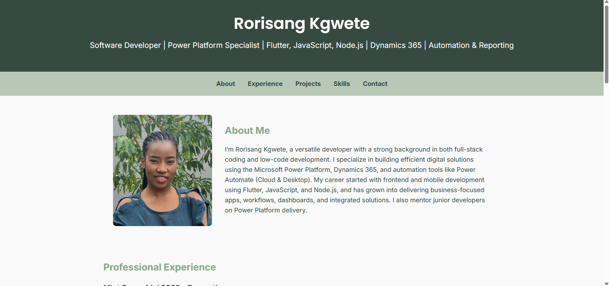

# About Me Website
A clean, responsive personal portfolio site built using HTML and CSS.  
This project highlights my skills, professional experience, and background as a full-stack and low-code developer.

## 🌟 Features
* **Responsive Design**: Adjusts layout for desktop, tablet, and mobile
* **About Section**: Displays a brief bio with image
* **Professional Experience**: Timeline of work experience and projects
* **Navigation**: Easy-to-use section links
* **Modern Styling**: Custom CSS with a soft, elegant color palette

## 🚀 Technologies Used
* HTML5
* CSS3
* Git & GitHub
 
## 📸 Preview

[Live Demo][[(https://rorisang07.github.io/About-Me/)]]

## Authors
* 👤Rorisang Kgwete
* https://github.com/Rorisang07

